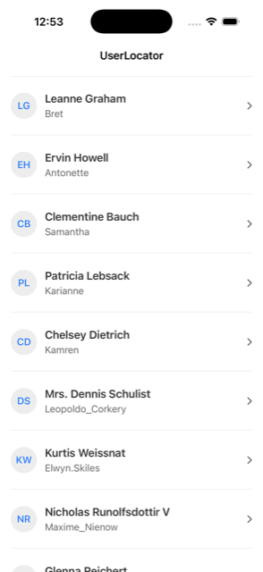
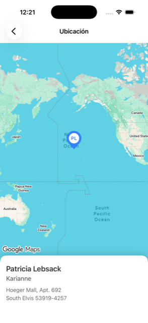

# UserLocator

A native iOS app that lists the users of the public JSONPlaceholder API and places the one you pick
on a Google map.

Each row in the list shows the person's name, their username and an avatar with their initials.
While the data is in flight an animated skeleton stands in for it; if the API fails, a clear message
with a retry button takes its place; and pulling down asks for the data again. Tapping a row opens
the map, centred on that person's location, with a marker drawn by the app carrying their initials
and a card at the bottom with their name, username and postal address.

The interface is in Spanish. It works in light and dark appearance, from an iPhone SE to a Pro Max,
in portrait and landscape, and follows whatever text size the system is set to.

## Contents

- [UserLocator](#userlocator)
  - [Contents](#contents)
  - [Screenshots](#screenshots)
  - [Requirements](#requirements)
  - [Running it](#running-it)
  - [External libraries](#external-libraries)
  - [Architecture](#architecture)
  - [Folder map](#folder-map)
  - [Design patterns](#design-patterns)
  - [Testing strategy](#testing-strategy)
  - [Technical decisions and trade-offs](#technical-decisions-and-trade-offs)

## Screenshots

| User list | Map |
|---|---|
|  |  |

## Requirements

These are the versions the project is developed and verified against.

| Tool | Version |
|---|---|
| Xcode | 26.6 |
| Swift | 6.3.3, in Swift 6 language mode with complete strict concurrency |
| Minimum iOS | 17.0 |
| Google Maps iOS SDK | 11.1.0, through Swift Package Manager |
| SwiftLint | 0.65.1, optional, development only |

Xcode resolves the dependency on its own: `Package.resolved` is committed, so the project builds
against exactly the SDK version it was developed with. Neither CocoaPods nor Carthage is involved.

An Xcode older than 26 will not open the project, because it relies on file system synchronised
groups and on the Swift 6 language mode.

## Running it

**1. Configure the Google Maps API key.** This is the only manual step, and the map needs it to
render.

Get one from the [Google Cloud console](https://console.cloud.google.com/): create a project, enable
**Maps SDK for iOS** in the API library, and generate a key under *Credentials*. It is worth
restricting it to iOS apps and to the bundle identifier, `com.guadalupefermani.UserLocator`.

Then copy `Config/Secrets.example.xcconfig` to `Config/Secrets.xcconfig` and replace the placeholder
with your key. That file is listed in `.gitignore`: **the key is never committed**. It reaches the
app as an `Info.plist` entry that the build fills in from the xcconfig, and it is read at runtime.

**2. Open and run.** Open `UserLocator.xcodeproj` in Xcode, pick a simulator and run. From the
terminal, the equivalent is `xcodebuild build -scheme UserLocator -destination 'platform=iOS
Simulator,name=iPhone 17'`.

Skipping the first step does not break anything: the app still **builds and launches**, the list
works normally, and the map screen explains that the key is missing and how to configure it instead
of failing.

**3. Run the tests.** With `⌘U` in Xcode, or with `xcodebuild test -scheme UserLocator -destination
'platform=iOS Simulator,name=iPhone 17'`. There are 77 of them, and none needs the network or an API
key.

If you have SwiftLint installed, `swiftlint --strict` checks the style. It is not a build phase and
it is not needed to compile.

## External libraries

**The Google Maps iOS SDK**, and nothing else. It renders the map, places the marker and is the only
third-party code that ships inside the app.

Dropping the dependency is a real option: MapKit covers this use case natively, with no API key to
manage and no extra binary weight. The migration is contained by design — `GoogleMapView` is the
only file that imports `GoogleMaps`, so it would mean rewriting that wrapper and the marker's
drawing, and nothing above them.

Everything else is Apple's: SwiftUI for the interface, `URLSession` for networking, `@Observable`
for state, `NavigationStack` for navigation and **Swift Testing** for the tests. There is no
networking library, no dependency injection container and no mocking framework. The app is not big
enough for that coupling to pay off: each of those would bring a version to keep up with, an API to
learn and one more reason for the project to stop building, in exchange for wrapping platform
features that already cover what these two screens do.

SwiftLint falls outside that trade-off, because it never becomes part of the app: it runs during
development and keeps the style consistent without having to argue about it file by file.

## Architecture

**Clean Architecture, organised by feature, with MVVM in the presentation layer.** Three layers and
one rule that orders them.

**Domain.** The centre, and it depends on nothing: not on SwiftUI, not on UIKit, not on Google Maps,
not on `URLSession`. It holds the entities (`User`, `Address`, `Coordinate`), the domain errors and
the use cases, plus the repository **protocols**. Keeping it plain Swift is not purity for its own
sake: it is what lets the app's rules be tested without a simulator, without the network and without
elaborate test doubles.

**Data.** This layer talks to the outside world. It has the DTOs that mirror the API's JSON, the
mappers that turn them into domain entities, and the repository implementation, which translates
transport errors into domain errors. DTOs never leave this layer: if a field in the API is renamed,
the change dies in the mapper.

**Presentation.** SwiftUI and view models. The view models are `@MainActor`, expose observable state
and depend on use case **protocols**, never on repositories or the network. Views render and capture
intent; they hold no business logic.

The dependency rule always points inwards:

> View → ViewModel → Use case → Repository protocol ← Implementation → HTTPClient → URLSession

The arrows in the middle meet at the repository protocol: the domain declares what it needs and the
data layer satisfies it. That is why the domain does not know an API exists.

**Why this for a two-screen app.** It is more structure than two screens strictly need, and the
honest reason is that the layering is applied uniformly rather than derived screen by screen. What
it pays back is concrete and already visible in the tests. The list view model is exercised end to end — loading, loaded,
empty, error, retry, refresh — against a five-line test double, because it depends on a protocol
rather than on `URLSession`. Without that separation, those same tests would have to intercept
network traffic.

The cost is just as concrete: more types, and a mapping layer that, for an app that only displays
data, can read as ceremony. It earns its keep once the API's model and the screen's model start
drifting apart, which is exactly what happened here when the postal address had to be composed for
the card.

## Folder map

| Folder | What lives there |
|---|---|
| `App/` | The entry point and `AppDependencies`, the only place where concrete types are built |
| `Core/Networking/` | `HTTPClient` and its `URLSession` implementation, the endpoints and the transport errors |
| `Core/Configuration/` | Reading the API key at runtime |
| `Core/Formatting/` | Shared formatting rules, such as deriving initials from a name |
| `DesignSystem/Tokens/` | Colour, spacing, typography, radii, elevation and durations. No UI value is written loose in a view |
| `DesignSystem/Components/` | Reusable views: the avatar, the empty and error states, the loading skeleton |
| `Features/Users/Domain/` | Entities, use cases, errors and repository protocols |
| `Features/Users/Data/` | DTOs, mappers and the remote repository |
| `Features/Users/Presentation/UserList/` | The list screen: view, view model and its presentation model |
| `Features/Users/Presentation/UserMap/` | The map screen: view, view model, the SDK wrapper and the marker drawing |
| `Features/Users/Presentation/Navigation/` | Typed navigation routes |
| `Resources/` | The string catalog and the colour assets |
| `UserLocatorTests/` | Mirrors the production tree exactly, plus `Support/` with fixtures and doubles |

## Design patterns

**Repository.** `UserRepository` is a domain protocol; `RemoteUserRepository` implements it against
the API. The domain asks for users without knowing where they come from, and everything about the
API — the endpoint, the status codes, the JSON — stays on the far side of that protocol. It is also
what makes the use case testable against a hand-written double, with no network anywhere near the
test.

**Use case.** `FetchUsersUseCase` exposes a single operation, `execute()`, and delegates it to the
repository. It adds no behaviour but it is here because the layering is applied as a rule and not negotiated screen by screen, and what that buys today is the direction of the dependency — the view model depends on an
operation it can call, not on a store it could query, so the presentation layer never learns that a
repository exists.

**Constructor-based dependency injection.** Every dependency arrives through the initialiser, typed
as a protocol. `AppDependencies` is the only place in the codebase where concrete types are
constructed. There are no singletons and no `static shared`: a singleton is global state shared
across tests, and that is precisely the kind of coupling that breaks a suite.

**Mapper.** `UserMapper` turns DTOs into entities. It is a pure function with no state, which is why
it can be tested on its own. It is also where loose data from the API gets normalised — empty
address fields, for instance, become absence rather than an empty string.

**Adapter.** `GoogleMapView` wraps UIKit's `GMSMapView` in a `UIViewRepresentable` and is the only
file in the app that imports `GoogleMaps`. The SDK is not fully annotated for Swift 6 strict
concurrency, so keeping it behind one adapter keeps that friction in one file: no `GMS` type appears
anywhere else, and neither the view models nor the domain know which map is being drawn.

**Presentation models.** View models do not hand entities to views; they hand over resolved models
(`UserListItem`, `UserCard`) whose text is ready to draw. Deciding what is shown belongs to the view
model and can be asserted in a test, and the view is left to draw it.

## Testing strategy

77 tests written with **Swift Testing**, none of which touches the network or needs an API key. The
test doubles are hand-written against the protocols, without a mocking library: they are a few lines
each and they make what is being simulated explicit.

What is covered:

- **Mappers**, with a full payload, a minimal one and malformed values.
- **The HTTP client**, through a `URLProtocol` stub: success, decoding failure, error status codes
  and transport failure.
- **The repository**, checking that every transport error is translated into the right domain error.
- **Use cases**, on the happy path and on every failure path.
- **View models**, in every state they can reach: loading, loaded, empty, error, retry and refresh,
  including that a failed refresh does not wipe the data already on screen.
- **Formatting rules**, such as initials: compound names, single words, honorifics, accents and
  empty input.
- **The marker drawing**, by reading pixels from the generated image to verify its geometry, its
  palette and that it is redrawn when the appearance changes.

What is deliberately not tested: SwiftUI view bodies, the Google Maps wrapper and the dependency
wiring. Those are declarative or integration code whose behaviour is verified by looking at the app,
not by asserting on it. There are no snapshot tests either: they would add an external dependency
and reference images that are fragile across iOS versions.

The rules the app leans on — how an address is formatted, how initials are derived, how an error is
translated — are covered, and that is where a change breaks silently.

## Technical decisions and trade-offs

**iOS 17 as the floor.** It is the lowest version that offers `NavigationStack`, the `@Observable`
macro and complete strict concurrency. The project was generated with an iOS 26 target, which was
the SDK's version rather than a product decision: it would have excluded nearly every real device
in exchange for nothing.

**Swift 6 with complete strict concurrency.** The compiler checks actor isolation, and data races
turn from intermittent production bugs into compile errors. It costs more to write — especially
around the Google SDK, which is not annotated — and that cost is the point.

**The domain imports nothing.** Not even `Foundation` for networking types. The upside is that its
tests run without infrastructure; the cost is the mapping layer between DTO and entity, which in an
app that only reads data can look like extra work.

**The marker is drawn at runtime.** It is a teardrop carrying the person's initials, produced with
`UIGraphicsImageRenderer` instead of an image asset. It stays sharp at any screen density, follows
the light or dark appearance, and adds nothing to the bundle. In exchange, there is geometry in the
code, and its correctness is verified by reading pixels.

**Without a key, the app does not fall over.** If `Secrets.xcconfig` is missing, the map screen
shows a state explaining what is missing and the rest of the app keeps working. Crashing on a
missing configuration file sends whoever runs it for the first time to debug the setup instead of
seeing the app.

**Rows without a coordinate do not navigate.** JSONPlaceholder could return a user without a valid
location, and opening an empty map would be worse than not opening one. The type that travels in the
navigation route enforces this by requiring a coordinate: the map screen cannot exist without one,
and no defensive `if` is needed to remember it.

**No cache and no persistence.** The app asks for the data and shows what it gets. Keeping it
between sessions would add a layer with its own invalidation rules, and nothing in the app's current
behaviour depends on having the data offline.

**A Spanish interface, driven by a string catalog.** No user-facing string is written in code. There
is a single language today, but adding another one means translating a file, not touching views.
